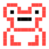

<p align="center">
  
</p>

<h1 align="center">Brag Frog</h1>

<p align="center">A daily workflow and check-in tool to log, reflect and grow your career.<br>Auto-prep 1:1s, log your work, and reflect on your impact.</p>

<p align="center">
  <a href="https://github.com/gruberb/brag-frog/blob/main/LICENSE">
    
  </a>
  <a href="https://github.com/gruberb/brag-frog/blob/main/CONTRIBUTING.md">
    
  </a>
  
  
  
  
</p>

## Features

- **Dashboard** — upcoming meetings with join links, weekly check-in prompt, OKR snapshot, focus goals with attached documents, focus time overview
- **Meeting prep** — prepare for 1:1s and meetings, optionally with AI-generated talking points
- **Logbook** — contributions organized by week with filters (source, type, goal, KR, search) and inline analysis
- **Sync from 7+ sources** — GitHub, Phabricator, Bugzilla, Jira, Confluence, Google Drive, Google Calendar
- **Measurable OKRs** — goals → key results (numeric/boolean/milestone/manual) → auto-scoring, with initiatives
- **Weekly check-ins** — structured reflection with energy/productivity vibe check and KR progress updates
- **Impact stories** — Situation/Actions/Result narratives linking entries
- **AI self-review drafts** — generates structured reflections (BYOK Anthropic API key)
- **Trends & analytics** — category distribution, KR progress, code/ticket activity across a cycle
- **Quick navigation** — Cmd+K command palette for fast access
- **Career level guide** — reference your org's IC ladder expectations alongside your work
- **Slide-over panels** — Linear/Zed-inspired panel UX for viewing and editing entries without leaving the page
- **Data export** — Markdown or JSON, your data is yours

## Tech stack

Rust (Axum) + SQLite + Tera templates + HTMX. No build step. Server-side rendered. All API tokens encrypted at rest with AES-256-GCM.

## Quick start

```bash
cp .env.example .env
# Fill in the required values (see below), then:
cargo run
# → http://localhost:8080
```

### Required env vars

| Variable | How to get it |
|---|---|
| `BRAGFROG_GOOGLE_CLIENT_ID` | [Google Cloud Console](https://console.cloud.google.com/apis/credentials) — create an OAuth 2.0 Client ID |
| `BRAGFROG_GOOGLE_CLIENT_SECRET` | Same as above |
| `BRAGFROG_ENCRYPTION_KEY` | `openssl rand -base64 32` |

### Optional

| Variable | What it does |
|---|---|
| `BRAGFROG_INSTANCE_NAME` | Shows "Brag Frog \| {name}" on the login page |
| `BRAGFROG_ALLOWED_DOMAIN` | Restrict sign-ups to a specific email domain (e.g. `your-company.com`) |
| `BRAGFROG_PUBLIC_ONLY` | Only sync public/non-confidential data (default: `false`) |
| `BRAGFROG_AI_MODEL` | Anthropic model for summaries (default: `claude-sonnet-4-5-20250929`) |
| `BRAGFROG_PORT` | Server port (default: `8080`) |
| `BRAGFROG_DATABASE_PATH` | SQLite database path (default: `bragfrog.db`) |

See [`.env.example`](.env.example) for the full list.

## Docker

```bash
docker build -t brag-frog .
docker run -p 8080:8080 \
  -e BRAGFROG_GOOGLE_CLIENT_ID=... \
  -e BRAGFROG_GOOGLE_CLIENT_SECRET=... \
  -e BRAGFROG_ENCRYPTION_KEY=... \
  -v bragfrog-data:/data \
  brag-frog
```

### Docker Compose

```bash
cp .env.example .env   # edit with your credentials
docker compose up -d
```

## Deployment

See [docs/self-hosting.md](docs/self-hosting.md) for full deployment instructions covering:

- **Docker / Docker Compose** — recommended for most teams
- **Bare metal** — single binary + static assets
- **Fly.io** — with persistent volumes
- **Google OAuth setup** — step-by-step credential creation

## Customization

Brag Frog is configurable for any organization. Create a `custom/` directory in the project root with your own versions of the config files:

| File | What it controls |
|------|-----------------|
| `clg_levels.toml` | Career ladder (levels, titles, competency descriptions) |
| `review_sections.toml` | Performance review sections and AI prompts |
| `services.toml` | Service URLs, default orgs, sync filters |
| `tokens.css` | Brand colors, fonts, CSS design tokens |

On startup, the app checks `custom/` first, then falls back to `config/`. See the files in `config/` for the format.

See [docs/customization.md](docs/customization.md) for details.

## Testing

```bash
cargo test
```

## Dev docs

- [Getting Started](docs/getting-started.md) — developer setup, running tests, common dev tasks
- [Architecture](docs/architecture.md) — module map, request lifecycle, database design, sync architecture
- [CLAUDE.md](CLAUDE.md) — conventions and gotchas (for AI-assisted development)

## License

[Mozilla Public License 2.0](LICENSE)
